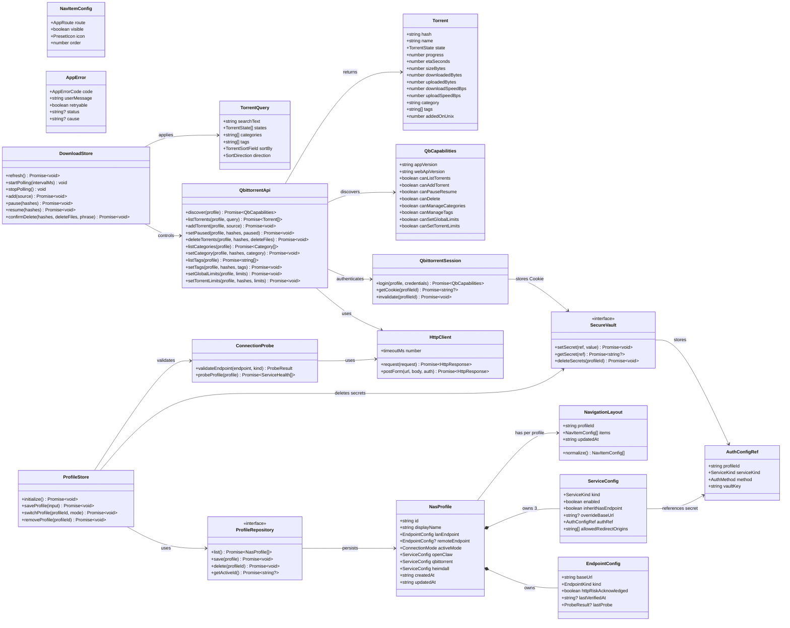
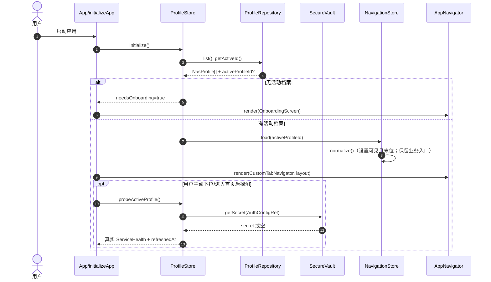
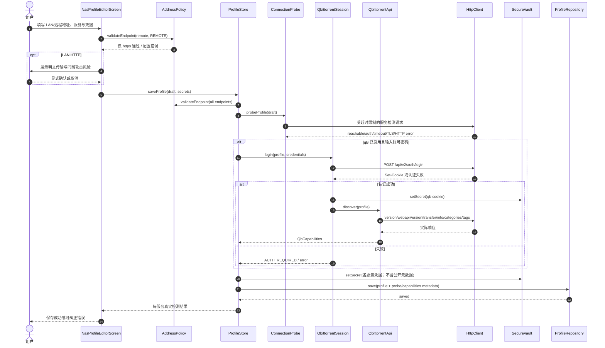
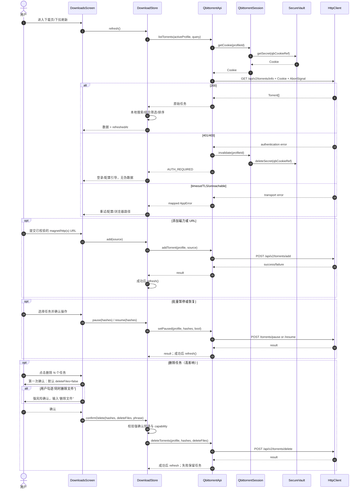
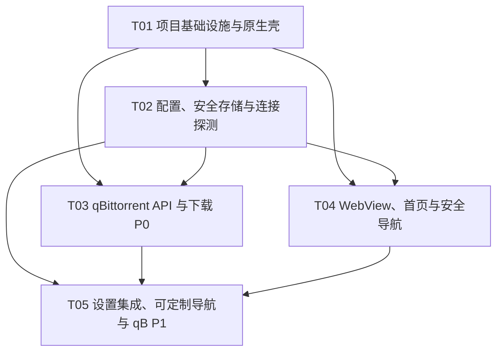

# NAS Mobile v0.2 技术架构与实施任务分解

> 基准：`docs/nas-mobile-prd.md` v0.2  
> 目标：原生可安装的 iOS/Android 跨平台应用；本轮仅完成 Android-first MVP 可运行源码结构与可验证集成，不承诺在当前环境完成 iOS 编译、签名或分发。

## A. 系统设计

### 1. 实施方案与框架选型

#### 1.1 总体架构

采用**单体移动客户端 + 用户自托管服务直连**：应用不建设中转、账户、代理或遥测后端。每个 NAS 档案保存两条候选基础地址（局域网与远程），用户在设置中手动选择当前模式；服务可继承该基础地址或使用独立覆盖地址。请求由服务适配器直接发送到用户选择且校验通过的地址；OpenClaw/Heimdall 使用受控 WebView；qBittorrent 使用 Web API，不能安全调用或能力不支持时只展示真实错误或跳转安全 WebView，绝不绕过认证。

分层采用 **Clean Architecture 的轻量实现 + MVVM**：

- **Presentation**：React 页面、可复用组件、React Navigation；页面只触发 store 的意图和渲染 view state。
- **Application / State**：Zustand store 编排启动恢复、档案切换、健康探测、qBittorrent 轮询及高影响操作确认。
- **Domain**：TypeScript 类型、地址策略、错误映射、qBittorrent 能力模型、纯筛选/排序函数；可单测。
- **Infrastructure**：安全存储、非敏感本地持久化、HTTP 客户端、qBittorrent API、WebView 导航策略、Android 原生网络安全配置。

此方案保持首期简单：不引入后端、ORM、Redux、自动设备发现、后台常驻服务或通用 DI 容器；通过工厂函数把基础设施注入 store，便于替换与测试。

#### 1.2 难点与技术决策

| 难点 | 设计决策 |
|---|---|
| iOS/Android 要求原生安装包与安全能力 | 使用 **React Native CLI**（社区模板），而非 Expo managed workflow。CLI 能明确维护 `android/`、`ios/`、Android Network Security Config、原生安全存储和构建签名边界；Expo managed 对 HTTP 明文、私有 CA/证书异常策略和原生网络配置仍可能需 prebuild/自定义原生代码，反而增加不可审计复杂度。可使用 Metro/Jest，Android 先行通过 Gradle 产出调试/签名包。iOS 在 macOS/Xcode/签名资料齐备后由 CI 或维护者构建，不在当前环境承诺完成。 |
| 多 NAS + 双地址 + 凭据隔离 | `NasProfile` 的公开元数据存 AsyncStorage；密码、Token、Web API Cookie、局域网 HTTP 风险确认放 Keychain/Keystore，键名带 `profileId` / `serviceId` 命名空间。删除档案时同步删除对应敏感键。只允许手动切换模式，不做自动健康切换或扫描。 |
| HTTPS/HTTP 与不信任证书 | 远程 URL 解析后必须为 `https:`；局域网可为 HTTP/HTTPS。保存 HTTP 地址前显示风险确认并存储确认记录。**风险说明：Android Network Security Config 与 iOS ATS 的按域例外是构建期静态配置，不能安全地只为运行时未知的用户主机开放。**若要兑现任意 LAN HTTP，原生工程必须开启应用级明文例外；应用层 `AddressPolicy` 再强制只向已确认的档案地址发请求、WebView 同样受白名单约束，并将该例外列为发布安全审查项。更安全的产品选择是首版仅允许 LAN HTTPS；须由产品/安全方确认二选一。TLS 验证错误不得忽略、不得“信任所有证书”、不得上传证书；映射为 `TLS_CERTIFICATE_UNTRUSTED`，引导用户修复 NAS/反向代理证书或在浏览器核验。自签名/私有 CA 首期不提供绕过开关；如需支持，后续仅考虑由用户显式导入并固定公钥/CA 的原生实现，须安全评审。 |
| WebView 嵌入第三方服务 | `react-native-webview` 注入最少配置，`originWhitelist` 与 `onShouldStartLoadWithRequest` 只放行配置服务的 HTTPS/已确认 HTTP 源站及用户显式声明的必要登录跳转域；导航到其他域名时展示域名确认，再以系统浏览器打开，不能在 WebView 静默跨域。禁用任意 `postMessage` 桥接与调试；仅在用户操作时清会话。服务自身登录、Cookie、CSP 与权限完全由服务端决定。 |
| qBittorrent Web API 版本/反向代理差异 | 先认证、再用 `/api/v2/app/version`、`/api/v2/app/webapiVersion`、`/api/v2/transfer/info`、`/api/v2/torrents/categories`、`/api/v2/torrents/tags` 探测；按 HTTP 码/响应内容建立 capability。仅调用已探测到、当前账号有权限、且经用户确认的操作；兼容失败保留已可用的只读列表或受控 WebView 降级，不能伪造成功或猜测端点。 |
| 轮询、超时与错误体验 | 使用 `fetch` + `AbortController`（默认 10 s，可配置）及 `NetInfo` 快速断网提示；仅在下载页前台且开启自动刷新时轮询（默认 15 s，最低 10 s），切后台即暂停。所有运输/HTTP/API 错误映射成稳定的 `AppErrorCode` 和可执行 action。 |

#### 1.3 框架与库选择

| 范围 | 选择 | 理由 |
|---|---|---|
| 运行时 | React Native CLI + React 18 + TypeScript strict | 共享业务/UI 代码，保留原生工程、系统安全与打包控制；类型约束 API 和敏感模型。 |
| 导航 | React Navigation（bottom tabs + native stack） | 支持可重建的自定义 Tab 项、深层设置流和原生过渡；设置强制固定末位。 |
| UI | React Native 原生组件 + React Native Paper + React Native Vector Icons | Material 风格表单、反馈和对话框，适合 Android-first；图标仅从受控集合选择。 |
| 状态 | Zustand + Immer | 小型、直接、可按档案切片；避免 Redux 样板，并可在单元测试注入假 API。 |
| 安全/本地存储 | `react-native-keychain` + `@react-native-async-storage/async-storage` | Keychain/Keystore 仅放密码、令牌、qB Cookie 与风险确认；非敏感档案、导航布局、最近状态放 AsyncStorage。 |
| 网络 | 原生 `fetch`、`AbortController`、`@react-native-community/netinfo` | 不增加 HTTP 客户端抽象依赖；显式 Cookie header 和超时取消，离线提前识别。 |
| Web | `react-native-webview` + `react-native-inappbrowser-reborn` | 受控内嵌服务与系统浏览器外开；不共享 app API 凭据给 WebView。 |
| 表单/拖拽 | React Hook Form + Zod；`react-native-draggable-flatlist` | 类型化配置校验、风险确认字段，以及导航排序。 |
| 测试 | Jest + React Native Testing Library + MSW | 单测领域/接口适配器，组件与交互测试；MSW 可模拟 qB API/认证/兼容失败。 |
| Android 构建/分发 | Gradle + Android App Bundle（内测可 APK）；Fastlane（后续 CI） | 首期先能构建并在真机安装验证；生产签名密钥只由安全 CI/发布责任人持有。iOS 采用 Xcode archive/TestFlight 或企业渠道，由拥有 macOS 和签名资料的流水线执行。 |

### 2. 文件清单

> 移动端在仓库根目录新增 `nas_mobile/`，不修改现有 Web 业务。`*.test.ts(x)` 为首期必须测试文件；原生生成文件、锁文件未逐一列出。

```text
nas_mobile/
├── package.json
├── tsconfig.json
├── babel.config.js
├── metro.config.js
├── jest.config.js
├── .eslintrc.cjs
├── .prettierrc.json
├── index.js
├── App.tsx
├── android/
│   └── app/src/main/
│       ├── AndroidManifest.xml
│       ├── res/xml/network_security_config.xml
│       └── res/values/strings.xml
├── ios/
│   └── NasMobile/Info.plist
├── src/
│   ├── bootstrap/
│   │   ├── createDependencies.ts
│   │   └── initializeApp.ts
│   ├── domain/
│   │   ├── models.ts
│   │   ├── appError.ts
│   │   ├── addressPolicy.ts
│   │   ├── qbittorrentCapabilities.ts
│   │   └── torrentSelectors.ts
│   ├── infrastructure/
│   │   ├── storage/secureVault.ts
│   │   ├── storage/profileRepository.ts
│   │   ├── network/httpClient.ts
│   │   ├── network/errorMapper.ts
│   │   ├── network/connectionProbe.ts
│   │   ├── qbittorrent/qbittorrentApi.ts
│   │   ├── qbittorrent/qbittorrentSession.ts
│   │   ├── webview/navigationPolicy.ts
│   │   └── external/openInBrowser.ts
│   ├── state/
│   │   ├── appStore.ts
│   │   ├── profileStore.ts
│   │   ├── serviceStore.ts
│   │   ├── downloadStore.ts
│   │   └── navigationStore.ts
│   ├── navigation/
│   │   ├── routeTypes.ts
│   │   ├── AppNavigator.tsx
│   │   └── CustomTabNavigator.tsx
│   ├── screens/
│   │   ├── OnboardingScreen.tsx
│   │   ├── HomeScreen.tsx
│   │   ├── ServiceWebViewScreen.tsx
│   │   ├── DownloadsScreen.tsx
│   │   ├── SettingsScreen.tsx
│   │   ├── NasProfileEditorScreen.tsx
│   │   └── NavigationEditorScreen.tsx
│   ├── components/
│   │   ├── common/AsyncStateView.tsx
│   │   ├── common/ErrorActionPanel.tsx
│   │   ├── common/ConfirmImpactDialog.tsx
│   │   ├── common/ServiceStatusCard.tsx
│   │   ├── downloads/TorrentListItem.tsx
│   │   ├── downloads/TorrentFilters.tsx
│   │   ├── downloads/AddTorrentDialog.tsx
│   │   └── web/SafeServiceWebView.tsx
│   └── __tests__/
│       ├── domain/addressPolicy.test.ts
│       ├── domain/torrentSelectors.test.ts
│       ├── infrastructure/qbittorrentApi.test.ts
│       ├── infrastructure/connectionProbe.test.ts
│       ├── state/downloadStore.test.ts
│       ├── components/ConfirmImpactDialog.test.tsx
│       └── screens/DownloadsScreen.test.tsx
└── e2e/
    ├── maestro/onboarding-and-profile.yaml
    └── maestro/download-control-safety.yaml
```

### 3. 数据结构与接口



#### 3.1 地址、安全与错误接口约定

1. `validateEndpoint(raw, kind)` 必须使用标准 URL 解析器；拒绝用户名密码嵌入 URL、fragment、未知 scheme、空 host。`REMOTE` 仅接受 `https:`；`LAN` 接受 `http:` 或 `https:`，HTTP 必须有 `httpRiskAcknowledged=true` 才能保存/请求。
2. 地址比较基于规范化 `scheme + hostname + effectivePort + basePath`；禁止域名模糊匹配。服务覆盖地址也经过同一验证。
3. HTTP 请求须携带 `AbortSignal`，默认 10 秒；网络离线、超时、DNS/连接失败、HTTP 401/403、HTTP 404/405、HTTP 5xx、qB API 业务错误及 TLS 错误均映射到：`OFFLINE`、`TIMEOUT`、`UNREACHABLE`、`AUTH_REQUIRED`、`FORBIDDEN`、`UNSUPPORTED_API`、`SERVER_ERROR`、`TLS_CERTIFICATE_UNTRUSTED`、`INVALID_CONFIGURATION`。UI 只显示安全化用户文案与下一步，不输出 URL 中潜在敏感内容、Cookie 或密码。
4. `SecureVault` 绝不被序列化至 Zustand persist、导出文件、崩溃日志或开发日志。`AuthConfigRef` 仅存键引用；WebView Cookie 与 qB API Cookie 分开命名空间，互不读取/互不注入。
5. `ProbeResult` 是真实检测结果（`reachable/auth_required/unreachable/tls_error/disabled/not_configured`），并带时间戳；首页只能显示最近一次成功或失败探测，不得伪造在线。

#### 3.2 qBittorrent Web API 适配与会话策略

**认证**：账号密码仅从 `SecureVault` 读取，在 HTTPS 或已显式确认的局域网 HTTP 上以 `application/x-www-form-urlencoded` POST 至 `POST /api/v2/auth/login`（`username`、`password`）。成功仅依据 qB 返回的成功响应与 `Set-Cookie` 中会话 Cookie；Cookie 用安全存储按 `profileId:qbittorrent` 隔离，后续仅作为该配置服务请求的 `Cookie` header。401/403 或 `Fails.` 响应立即清理 Cookie，标为需重新认证。不得保存明文到 AsyncStorage、不得将 Cookie 共享给 OpenClaw/Heimdall WebView、不得实现默认密码/重试猜测。

**初始化/探测顺序**：认证成功后请求：

- `GET /api/v2/app/version`、`GET /api/v2/app/webapiVersion`：记录实际版本；失败时提示反向代理路径/API 不兼容。
- `GET /api/v2/transfer/info`：确认基本 Web API 访问与全局速度字段能力。
- `GET /api/v2/torrents/info`：确认列表权限；仅使用服务实际返回字段。
- `GET /api/v2/torrents/categories` 与 `GET /api/v2/torrents/tags`：确认分类/标签读取能力。

每次动作前按 `QbCapabilities` 门禁，403 映射权限不足，404/405 或不符合的 API 响应映射版本/反向代理不支持。首期支持 qB 标准 `/api/v2` 根路径；若用户服务采用子路径，由其服务地址 `baseUrl` 显式包含子路径，客户端不猜测改写。

| 功能 | Web API 端点与关键参数 | MVP 行为/降级 |
|---|---|---|
| 列表、筛选、排序、刷新 | `GET /api/v2/torrents/info?filter=&category=&tag=&sort=&reverse=`，必要时由本地 `torrentSelectors` 进行名称/多标签组合过滤 | P0。字段缺失显示“服务未提供”，不构造数值；列表能力失败时显示错误及安全 WebView 入口。 |
| 添加磁力/URL | `POST /api/v2/torrents/add`，form `urls`，可选 `category/tags`（仅已探测支持时） | P0。仅接受 `magnet:` 或 http(s) URL；提交成功后刷新，非成功不乐观插入。 |
| 暂停/恢复（单/批） | `POST /api/v2/torrents/pause`、`POST /api/v2/torrents/resume`，form `hashes`（`|` 分隔） | P0。根据返回后刷新确认；不支持或权限不足保留当前状态并提示。 |
| 删除任务/可选删文件 | `POST /api/v2/torrents/delete`，form `hashes`、`deleteFiles=false/true` | P0。首次确认明确任务数与默认 `false`；勾选 `true` 后要求输入固定确认短语（如“删除文件”）再提交；失败不从列表移除。 |
| 读取/编辑分类 | `GET /api/v2/torrents/categories`；`POST /api/v2/torrents/setCategory`（`hashes`,`category`）；可选 `createCategory/editCategory/removeCategories` | P1。先落实读取和为任务设定；创建、编辑、删除分类必须在目标版本/权限验证后才显示。 |
| 读取/编辑标签 | `GET /api/v2/torrents/tags`；`POST /api/v2/torrents/addTags`、`removeTags` | P1。批量更新后刷新；不支持时隐藏编辑但保留服务已返回标签的只读展示。 |
| 全局限速 | `GET /api/v2/transfer/info`；`POST /api/v2/transfer/setDownloadLimit`、`setUploadLimit`（`limit` bytes/s） | P1。提交前显示全局影响；0 是否代表无限速必须以目标 qB 版本实测确认。 |
| 任务级限速 | `POST /api/v2/torrents/setDownloadLimit`、`setUploadLimit`（`hashes`,`limit`） | P1。先由能力探测/实测矩阵启用；端点不可用时不给误导性开关。 |

> qBittorrent 的具体最低版本、代理认证/SSO 行为与任务级限速语义在实施前必须以目标 NAS 实例和官方目标版本文档验证；此表是调用边界，不是认证规避或兼容性承诺。

### 4. 程序调用流程

### 4. 程序调用流程

#### 4.1 首次启动、档案初始化与导航恢复



#### 4.2 保存 NAS 地址、验证并建立 qB 会话



#### 4.3 qBittorrent 列表刷新、添加、批量控制与强确认删除



### 5. 不明确项、假设与阻塞

1. **LAN HTTP 原生策略（阻塞发布）**：PRD 允许手动 LAN HTTP，但移动平台的网络安全例外不能按运行时任意 host 静态收窄。必须确认：A) 首期仅 LAN HTTPS（推荐），或 B) Android/iOS 允许 app 级明文并接受应用层白名单缓解与商店审核风险。未决前不要将全局 `usesCleartextTraffic=true` 作为默认提交。
2. **最低版本与分发**：需明确 iOS/Android 最低系统版本、Google Play/App Store/企业签名/侧载渠道、Bundle ID、签名资料与发布责任人。当前环境只验收 Android-first 源码与在可用 Android SDK 上的构建；iOS 编译需 macOS、Xcode 和签名资产。
3. **目标 qBittorrent 矩阵（阻塞 P1）**：需给出 Web UI 目标版本、是否使用反向代理子路径、账号密码或 SSO、Cookie 的 `SameSite/Secure` 属性、以及任务级限速端点的实机结果。应用不能为未知版本承诺 P1。
4. **OpenClaw/Heimdall WebView 可嵌入性**：需提供各服务真实 URL、登录/SSO 重定向域、是否禁止嵌入、移动端行为。必要跳转域必须由用户配置/确认，不可使用泛域名白名单。
5. **多用户与共享**：当前假设单设备单用户、每个档案本地隔离；不做配置/凭据共享。如果要家庭共享，NAS 最小权限账号、设备侧访问控制和导入签名需单独设计。
6. **导入导出与推送**：P1 导出仅含公开配置和布局，密码/Token/Cookie 永远排除；导入先预览、校验并由用户逐项重新输入凭据。P2 通知、后台刷新、远程唤醒均不纳入 MVP，因其涉及权限、耗电和安全通知通道。
7. **导航规则假设**：每 NAS 独立布局；默认最多显示 5 项，设置永远可见且最后；至少保留首页或一个已启用业务入口。预设图标与文案集合由产品在实施前冻结。

## B. 任务分解

### 6. 所需第三方依赖

```text
- react@^18.2.0: React UI 运行时
- react-native@^0.74.0: 原生跨平台应用框架（具体小版本随 CLI 模板锁定）
- typescript@^5.4.0: 严格类型检查
- @react-navigation/native@^6.1.0: 导航核心
- @react-navigation/bottom-tabs@^6.5.0: 可定制底部导航
- @react-navigation/native-stack@^6.9.0: 原生堆栈导航
- react-native-screens@^3.31.0: 原生导航屏幕支持
- react-native-safe-area-context@^4.10.0: 安全区域支持
- zustand@^4.5.0: 轻量状态管理
- immer@^10.1.0: 不可变状态更新
- @react-native-async-storage/async-storage@^1.23.0: 非敏感本地持久化
- react-native-keychain@^8.2.0: iOS Keychain / Android Keystore 敏感存储
- @react-native-community/netinfo@^11.3.0: 网络状态感知
- react-native-webview@^13.10.0: OpenClaw/Heimdall 安全内嵌页
- react-native-inappbrowser-reborn@^3.7.0: 系统浏览器外开
- react-native-paper@^5.12.0: 表单、对话框与反馈组件
- react-native-vector-icons@^10.1.0: 受控预设图标
- react-hook-form@^7.52.0: 配置表单状态
- zod@^3.23.0: 地址与表单 schema 校验
- @hookform/resolvers@^3.9.0: Zod 与表单集成
- react-native-draggable-flatlist@^4.0.1: 导航项拖拽排序
- jest@^29.7.0: 单元测试
- @testing-library/react-native@^12.5.0: React Native 组件测试
- msw@^2.3.0: qB API/网络错误模拟
- maestro@^1.38.0: Android 真机/模拟器端到端关键路径测试
```

> 初始安装前应以所选 React Native CLI 模板、Android Gradle Plugin 与 Node LTS 的兼容表锁定精确版本并提交 lockfile；不要仅按以上范围盲目升级。未选择 Axios、Redux、后端 SDK、分析 SDK 或任何扫描库。

### 7. 有序任务列表

| ID | 任务名称 | 源文件（创建/修改） | 依赖 | 优先级 | 验收点 |
|---|---|---|---|---|---|
| T01 | 项目基础设施与 Android-first 原生壳 | `nas_mobile/package.json`、`tsconfig.json`、`babel.config.js`、`metro.config.js`、`jest.config.js`、`.eslintrc.cjs`、`.prettierrc.json`、`index.js`、`App.tsx`、`android/app/src/main/AndroidManifest.xml`、`android/app/src/main/res/xml/network_security_config.xml`、`android/app/src/main/res/values/strings.xml`、`ios/NasMobile/Info.plist` | 无 | P0 | React Native CLI 工程可安装依赖、TypeScript/Jest 可执行；Android debug 在具备 SDK 的环境构建；原生网络策略仅按经批准的 HTTP 方案落地，iOS 仅保留待 Xcode 构建验证的配置。 |
| T02 | 配置档案、安全存储与连接探测数据层 | `src/domain/models.ts`、`appError.ts`、`addressPolicy.ts`、`src/infrastructure/storage/secureVault.ts`、`profileRepository.ts`、`src/infrastructure/network/httpClient.ts`、`errorMapper.ts`、`connectionProbe.ts`、`src/bootstrap/createDependencies.ts`、`src/state/profileStore.ts`、`src/__tests__/domain/addressPolicy.test.ts`、`src/__tests__/infrastructure/connectionProbe.test.ts` | T01 | P0 | 能新增/编辑/切换/删除隔离档案；远程非 HTTPS 被拒绝、LAN HTTP 无确认被拒绝；凭据不进入公开存储；可区分离线、超时、认证、TLS、服务端错误并记录真实刷新时间。 |
| T03 | qBittorrent API 适配、会话与下载 P0 | `src/domain/qbittorrentCapabilities.ts`、`torrentSelectors.ts`、`src/infrastructure/qbittorrent/qbittorrentSession.ts`、`qbittorrentApi.ts`、`src/state/downloadStore.ts`、`src/components/downloads/TorrentListItem.tsx`、`TorrentFilters.tsx`、`AddTorrentDialog.tsx`、`src/components/common/ConfirmImpactDialog.tsx`、`src/screens/DownloadsScreen.tsx`、`src/__tests__/infrastructure/qbittorrentApi.test.ts`、`src/__tests__/domain/torrentSelectors.test.ts`、`src/__tests__/state/downloadStore.test.ts`、`src/__tests__/components/ConfirmImpactDialog.test.tsx`、`src/__tests__/screens/DownloadsScreen.test.tsx`、`e2e/maestro/download-control-safety.yaml` | T01, T02 | P0 | 使用目标 qB 实例/API mock 验证登录 Cookie 隔离、版本/能力探测、列表/搜索筛选排序、手动刷新与前台可控轮询、磁力/URL 添加、单/批暂停恢复、二段式删除；默认永不删文件且失败不乐观更新。 |
| T04 | 服务 WebView、首页与安全导航 | `src/infrastructure/webview/navigationPolicy.ts`、`src/infrastructure/external/openInBrowser.ts`、`src/components/web/SafeServiceWebView.tsx`、`src/components/common/AsyncStateView.tsx`、`ErrorActionPanel.tsx`、`ServiceStatusCard.tsx`、`src/screens/HomeScreen.tsx`、`ServiceWebViewScreen.tsx`、`OnboardingScreen.tsx`、`src/__tests__/components/SafeServiceWebView.test.tsx`、`e2e/maestro/onboarding-and-profile.yaml` | T01, T02 | P0 | OpenClaw/Heimdall 仅加载经校验的服务 origin 与明确确认的跳转 origin；未知域不在 WebView 静默打开；加载、超时、失败、重试、配置与外开路径有效；首页显示真实或最近探测状态。 |
| T05 | 自定义导航、设置集成与 qB P1 能力开关 | `src/navigation/routeTypes.ts`、`AppNavigator.tsx`、`CustomTabNavigator.tsx`、`src/state/appStore.ts`、`serviceStore.ts`、`navigationStore.ts`、`src/screens/SettingsScreen.tsx`、`NasProfileEditorScreen.tsx`、`NavigationEditorScreen.tsx`、`src/domain/models.ts`、`src/infrastructure/qbittorrent/qbittorrentApi.ts`、`src/screens/DownloadsScreen.tsx`、`src/__tests__/state/navigationStore.test.ts`、`src/__tests__/screens/NavigationEditorScreen.test.tsx` | T02, T03, T04 | P1 | 设置可编辑服务开关/地址/凭据并呈现逐服务探测；导航保存后即时、按档案恢复，设置始终末位且不可隐藏；仅在 qB 实测 capability 与权限通过时开启分类/标签、全局/任务限速，操作前展示影响范围。 |

**本轮工程师落地范围**：以 T01–T04 为 Android-first MVP 的目标；至少交付可运行/可测试的源码结构、首次向导和手工档案配置、真实连接错误呈现、OpenClaw/Heimdall 受控 WebView、qB P0（须连接用户实际 qB 或 MSW mock 验证）。T05 的导航自定义基础可以并行搭建，但 P1 管理操作必须等待版本/权限矩阵确认。iOS 工程可生成和代码可编译性可检查，但不在当前环境承诺产出 iOS 安装包。

### 8. 跨文件约定（Shared Knowledge）

- 所有领域时间统一使用 ISO 8601 UTC 字符串；qB 返回 Unix 秒仅在适配器边界转换。大小/速度内部使用 bytes / bytes per second，UI 集中格式化。
- 公开状态持久化使用 `nas-mobile:profiles:v1`、`nas-mobile:layout:<profileId>:v1`；敏感项只可使用 `nas-mobile:secret:<profileId>:<service>:<kind>` 的 Keychain/Keystore key。任何导出、状态日志、错误对象均不得包含 secret 或 Cookie。
- 任何网络请求必须经 `HttpClient`，传入通过 `AddressPolicy` 验证的 endpoint 和 `AbortSignal`；禁止页面直接 `fetch`、禁止忽略 TLS、禁止任意 host 请求。
- API 内部结果使用 `Result<T, AppError>` 或抛出仅包含 `AppError` 的异常；UI 依据 `AppErrorCode` 映射文案/按钮，禁止按英文错误文本分支。
- qB 写操作必须先以 `QbCapabilities` 门禁，成功后以 refresh 复核；401/403 时删除该 profile 的 qB Cookie。所有 `hashes` 由 app 已加载任务产生，不拼接用户输入。
- 删除文件、全局/任务限速、恢复默认导航均是高影响操作，统一通过 `ConfirmImpactDialog`：说明对象/影响、默认安全选项、不支持乐观成功；删文件时额外校验确认短语。
- WebView 不可读取/注入 qB Cookie 或 app 安全存储凭据；只允许配置 origin 与显式确认的登录跳转 origin，其他链接显示完整 host 后交由系统浏览器。禁止任意 JS bridge 和调试开关。
- 自动刷新只在前台活跃页面运行，默认 15 秒、最低 10 秒；页面失焦或 AppState 非 active 立即停止。网络切换不自动改 LAN/remote 模式。
- 首期最小权限：不声明定位、存储、相册、联系人、麦克风等权限；通知/生物识别仅在后续用户主动启用时再接入。

### 9. 任务依赖图


